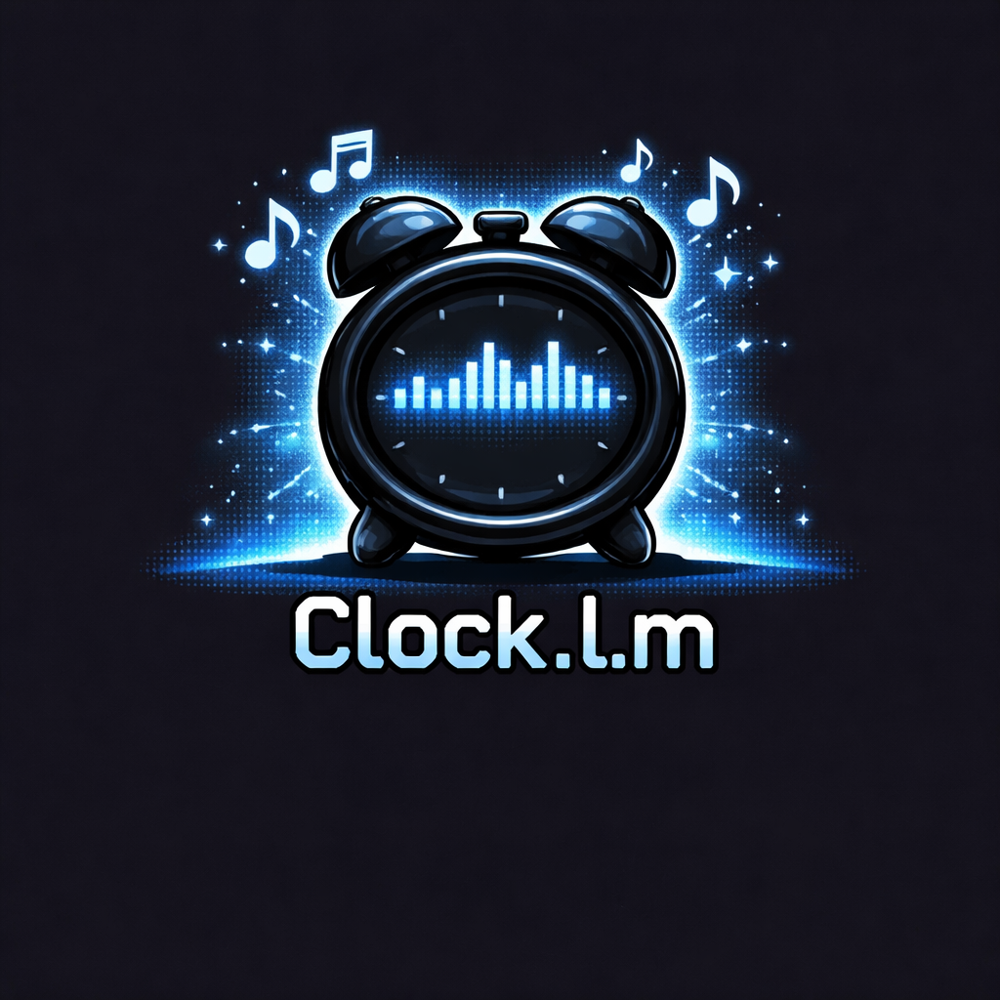
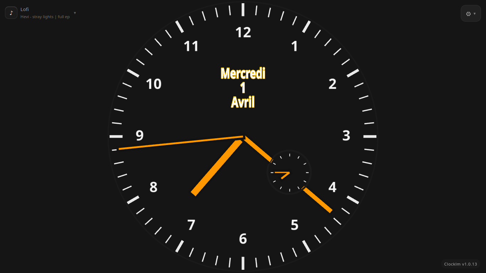
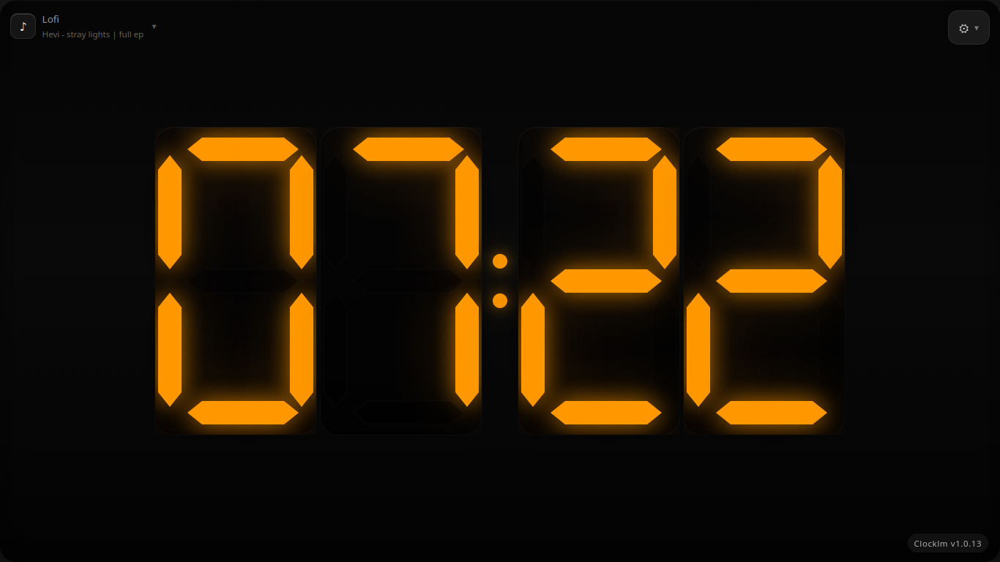
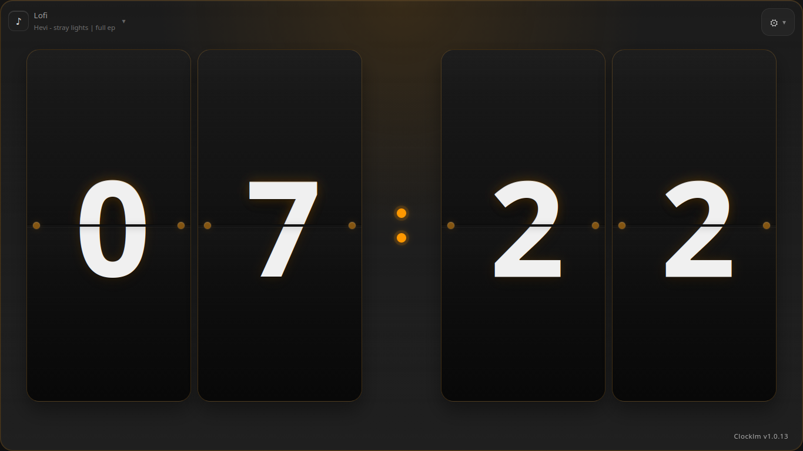

# Clock.l.m

<p align="center">
  
  
  
  
</p>

<p align="center">
  
  
</p>

<p align="center">
  
  
</p>

<p align="center">
  🕒 Horloges desktop elegantes en TypeScript, React, Three.js et Tauri.
</p>

<p align="center">
  Linux • Windows • macOS Intel
</p>

Clock.l.m est une application d'horloge et d'alarme orientee desktop, avec une presentation visuelle soignee et une base technique moderne. Le projet met l'accent sur plusieurs styles d'affichage, une interface claire et un packaging natif simple a distribuer.

## 📚 Sommaire

- [✨ Points forts](#-points-forts)
- [🖼️ Apercu](#️-apercu)
- [📦 Telechargements](#-telechargements)
- [🌐 Version web](#-version-web)
- [🚀 Demarrage rapide](#-demarrage-rapide)
- [🖥️ Compatibilite](#️-compatibilite)
- [🧱 Structure du projet](#-structure-du-projet)
- [🗺️ Roadmap](#️-roadmap)
- [🔄 Releases automatiques](#-releases-automatiques)
- [📝 Notes](#-notes)

## ✨ Points forts

- 🕰️ Plusieurs styles d'horloges dans une seule application
- ⚛️ Interface construite avec React et TypeScript
- 🌌 Rendu visuel enrichi avec Three.js
- 🖥️ Application desktop embarquee avec Tauri
- 🚀 Releases automatiques pour Linux, Windows et macOS Intel

## 🖼️ Apercu

Clocklm propose actuellement plusieurs variantes d'affichage :

- Horloge analogique
- Horloge numerique type seven-segment
- Horloge a lamelles

La base du projet est aussi prete pour accueillir la suite :

- Alarmes
- Reglages
- Options avancees

## 📦 Telechargements

Les builds desktop sont publies automatiquement a chaque tag de version.

### Formats disponibles

- Linux : `.AppImage`
- Linux : `.deb`
- Windows : `.msi`
- macOS Intel (`x64`) : `.dmg`

### Releases

- Toutes les versions : [page Releases](../../releases/latest)

## 🌐 Version web

Une version web statique est publiee via GitHub Pages :

- Site : [mrklm.github.io/clocklm](https://mrklm.github.io/clocklm/)

Cette version reprend l'interface React/Vite de Clock.l.m pour un usage dans le navigateur.

### Differences avec la version desktop

- Version web : accessible instantanement dans le navigateur, sans installation
- Version desktop : application Tauri native, plus adaptee a un usage quotidien local
- Version web : ne fournit pas l'emballage natif Tauri
- Version desktop : permet la distribution `.AppImage`, `.deb`, `.msi` et `.dmg`

## 🚀 Demarrage rapide

### Version web

```bash
npm install
npm run dev
```

### Build web

```bash
npm run build
```

### Version desktop Tauri

```bash
npm run tauri:dev
```

### Build desktop

```bash
npm run tauri:build
```

## 🖥️ Compatibilite

Le projet publie actuellement des builds pour :

- Ubuntu
- Windows
- macOS Intel (`x86_64`)

> ℹ️ Le build macOS fourni est uniquement destine aux Mac Intel.
> Le fichier publie est `Clocklm_macos_x64.dmg`.

## 🧱 Structure du projet

- `src/components` : composants generaux de composition
- `src/features/clocks` : composants et logique des differentes horloges
- `src/features/alarms` : base du futur module d'alarmes
- `src/three` : integration Three.js
- `src/types` : types partages
- `src/styles` : styles globaux et styles applicatifs
- `src-tauri` : couche desktop Tauri

## 🗺️ Roadmap

- ✅ Base React + TypeScript + Tauri en place
- ✅ Plusieurs styles d'horloges integres
- 🔄 Amelioration continue de l'interface desktop
- ⏰ Ajout du module d'alarmes
- 🎛️ Reglages utilisateur et options d'affichage
- 🍎 Signature et notarisation macOS a ajouter plus tard

## 🔄 Releases automatiques

Le workflow [`.github/workflows/tauri-release.yml`](.github/workflows/tauri-release.yml) publie automatiquement les artefacts GitHub Releases a chaque push de tag :

- `v*.*.*`
- `*.*.*`

### Artefacts publies

- Ubuntu : `.deb`
- Linux : `.AppImage`
- Windows : `.msi`
- macOS Intel : `.dmg`

Le workflow [`.github/workflows/pages.yml`](.github/workflows/pages.yml) publie de son cote la version web sur GitHub Pages a chaque push sur `main`.

## 📝 Notes

- L'identifiant d'application Tauri est `com.clocklm.app`.
- Pour macOS, seule la version Intel est actuellement publiee.
- Pour une distribution macOS propre hors usage personnel, il faudra ajouter la signature et la notarisation Apple plus tard.
